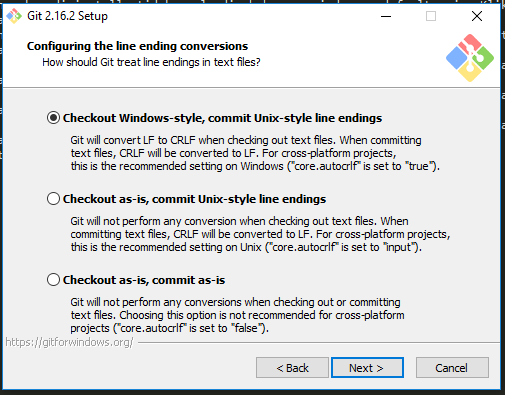
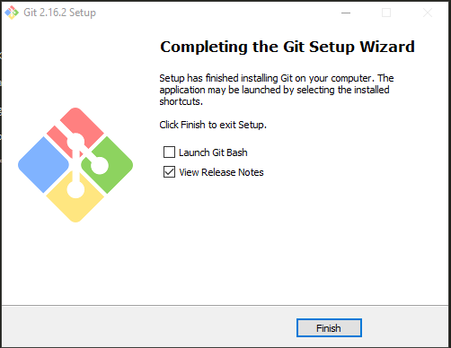

# MINGGU 01

## Cara Installasi Git di Windows 10

1. Download GitHub Desktop di Windows di [halaman Download Git For Windows](https://git-scm.com/downloads).

2. Jalankan installer yang sudah di download. akan muncul lisensi seperti berikut kemudian klik **Next >**

3. Selanjutnya pilih lokasi instalasi. Secara default akan terisi *C:\Program Files\Git*. Ganti lokasi jika memang anda menginginkan lokasi lain, dalam kesempatan ini saya tidak merubah lokasi. klik **Next**

4. Pilih komponen yang akan di install. tidak perlu dirubah, sesuai dengan default saja. Klik pada **Next**.

5. Selanjutnya isi shortcut untuk menu Start. kita dapat gunakan default (Git), atau menggantinya misalnya Git DJO. Klik pada **Next**.

6. Pilih editor yang akan digunakan bersama dengan Git. Pada pilihan ini, digunakan kita gunakan Notepad++. Klik pada **Next**.

7. Selanjutnya pilih metode penggunaan git. git menyediakan akses git ke GitBash maupun Command Prompt. pilih **Use git from the windows Command Prompt**. Kemudian **Next >**

8. Selanjutnya pilih OpenSSL untuk HTTPS. Git menggunakan https untuk akes ke repo GitHub atau repo-repo lain (GitLab, Assembla).  Klik pada **Next**.

9. Pilih pilihan pertama untuk konversi akhir baris (CR-LF). pilih **Check Out Windows Style** kemudian Klik pada **Next**.

10. selanjutnya kita pilih MinTY sebagai terminal yang digunakan untuk mengakses Git Bash. kemudian Klik pada **Next**.

11. Untuk opsi ekstra yang akan digunakan, pilih serta aktifkan 1 dan 2. kaemudian Klik pada **Next**.

12. Tunggu proses instalasi selesai.

13. Jika selesai akan muncul dialog pemberitahuan. Klik pada **Finish**.

14. jalankan Git Bash

15. hasilnya sebagai berikut

